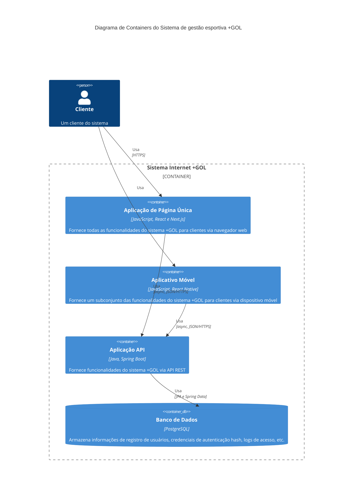

# Diagrama C4 de Contêiner
O diagrama apresentado é um C4 model do tipo Contêiner(nivel 2), que representa a arquitetura de conteiner da aplicação +GOL. O C4 model é uma abordagem para descrever arquiteturas de software, dividindo-as em contexto, contêineres, componentes e código. Esta divisão ajuda a entender e comunicar a estrutura de sistemas complexos de forma clara e eficaz.

Importância do C4 Model
O C4 model é essencial para visualizar a arquitetura de software, proporcionando uma visão abrangente dos contêineres e componentes que compõem o sistema. Ele facilita a comunicação entre equipes técnicas e não técnicas, ajuda na identificação de dependências críticas e suporta decisões de design e evolução do sistema de forma estruturada.

O contêiner é uma abstração de alto nível responsável por uma parte específica da funcionalidade do sistema. Pode ser uma aplicação web, um banco de dados, uma API, um serviço de microserviços, uma aplicação de linha de comando, entre outros.

